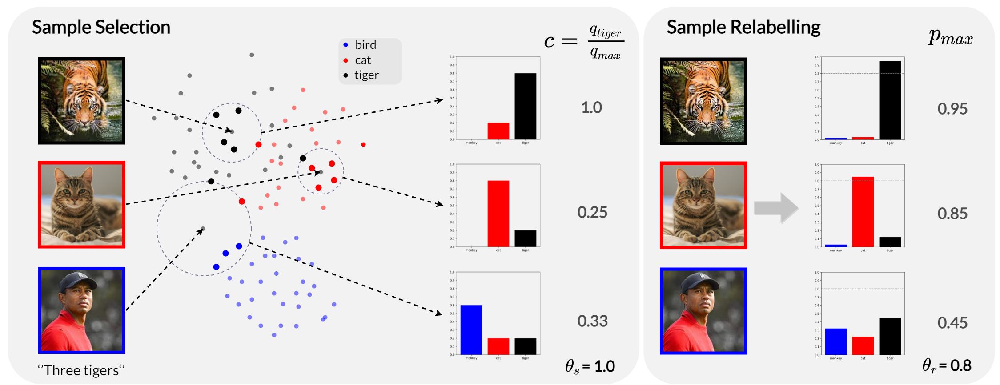

## SSR: An Efficient and Robust Framework for Learning with Unknown Label Noise

[](https://paperswithcode.com/sota/image-classification-on-cifar-10-with-noisy?p=s3-supervised-self-supervised-learning-under-1)
[](https://paperswithcode.com/sota/learning-with-noisy-labels-on-animal?p=s3-supervised-self-supervised-learning-under-1)
[](https://paperswithcode.com/sota/image-classification-on-mini-webvision-1-0?p=s3-supervised-self-supervised-learning-under-1)
[](https://paperswithcode.com/sota/image-classification-on-clothing1m?p=s3-supervised-self-supervised-learning-under-1)

**[New Update]
*We have extended this conference paper into a journal article! 
You can find the expanded journal version here: [NoiseBox: Towards More Efficient and Effective Learning with Noisy Labels.](https://ieeexplore.ieee.org/document/10594806)***

<p align="center">
    
</p>

This is the official PyTorch implementation of BMVC2022 paper([SSR: An Efficient and Robust Framework for Learning with Noisy Labels](https://arxiv.org/abs/2111.11288)). 


### Abstract
Despite the large progress in supervised learning with neural networks, there are significant challenges in obtaining high-quality, large-scale and accurately labeled datasets. In such a context, how to learn in the presence of noisy labels has received more and more attention. As a relatively comprehensive problem, in order to achieve good results, the current methods often integrate technologies from multiple fields, such as supervised learning, semi-supervised learning, transfer learning, and so on. At the same time, these methods often make strong or weak assumptions about the noise of the data. This also inevitably brings about the problem of model robustness.
Striving for simplicity and robustness, we propose an efficient and robust framework named Sample Selection and Relabelling(SSR), that minimizes the number of modules and hyperparameters required, and that achieves good results in various conditions. In the heart of our method is a sample selection and relabelling mechanism based on a non-parametric KNN classifier $g_q$ and a parametric model classifier $g_p$ , respectively, to select the clean samples and gradually relabel the closed-set noise samples.
Without bells and whistles, such as model co-training, self-supervised pertaining, and semi-supervised learning, and with robustness concerning settings of its few hyper-parameters, our method significantly surpasses previous methods on both CIFAR10/CIFAR100 with synthetic noise and real-world noisy datasets such as WebVision, Clothing1M and ANIMAL-10N.

```bibtex
@inproceedings{Feng_2022_BMVC,
author    = {Chen Feng and Georgios Tzimiropoulos and Ioannis Patras},
title     = {SSR: An Efficient and Robust Framework for Learning with Unknown Label Noise},
booktitle = {33rd British Machine Vision Conference 2022, {BMVC} 2022, London, UK, November 21-24, 2022},
publisher = {{BMVA} Press},
year      = {2022},
url       = {https://bmvc2022.mpi-inf.mpg.de/0372.pdf}
}
```
Please considering **_cite our paper and star the repo_** if you find this repo useful.

### Preparation
- pytorch
- tqdm
- wandb

### Usage
Example runs on CIFAR100 dataset with symmetric noise:
```
python main_cifar.py --theta_r 0.8 --noise_mode sym --noise_ratio 0.9 --dataset cifar100 --dataset_path path_to_cifar100

python main_cifar.py --theta_r 0.8 --noise_mode sym --noise_ratio 0.8 --dataset cifar100 --dataset_path path_to_cifar100

python main_cifar.py --theta_r 0.8 --noise_mode sym --noise_ratio 0.5 --dataset cifar100 --dataset_path path_to_cifar100

python main_cifar.py --theta_r 0.9 --noise_mode sym --noise_ratio 0.2 --dataset cifar100 --dataset_path path_to_cifar100
```

Example runs on WebVision/Clothing1M dataset~(Approximately ~16GB memory for clothing1M and ~36GB for WebVision, considering reduce the batch size or parallel training with more GPUs if you don't have enough GPU memory.):
```
python main_webvision.py --dataset_path ./WebVision --gpuid 0,1 --parallel

python main_clothing1m.py --dataset_path ./Clothing1M --gpuid 0
```

For users who are not familiar with wandb, please try `main_cifar_simple.py` with same config.


### Results
| Dataset       |  CIFAR10  |  CIFAR10  |  CIFAR10  |  CIFAR10  |   CIFAR10  |  CIFAR100 |  CIFAR100 |  CIFAR100 |  CIFAR100 |
|---------------|:---------:|:---------:|:---------:|:---------:|:----------:|:---------:|:---------:|:---------:|:---------:|
| Noise type    | Symmetric | Symmetric | Symmetric | Symmetric | Assymetric | Symmetric | Symmetric | Symmetric | Symmetric |
| Noise ratio   |    20%    |    50%    |    80%    |    90%    |     40%    |    20%    |    50%    |    80%    |    90%    |
| Cross-Entropy |    86.8   |    79.4   |    62.9   |    42.7   |    85.0    |    62.0   |    46.7   |    19.9   |    10.1   |
| Co-teaching+  |    89.5   |    85.7   |    67.4   |    47.9   |      -     |    65.6   |    51.8   |    27.9   |    13.7   |
| F-correction  |    86.8   |    79.8   |    63.3   |    42.9   |    87.2    |    61.5   |    46.6   |    19.9   |    10.2   |
| PENCIL        |    92.4   |    89.1   |    77.5   |    58.9   |    88.5    |    69.4   |    57.5   |    31.1   |    15.3   |
| LossModelling |    94.0   |    92.0   |    86.8   |    69.1   |    87.4    |    73.9   |    66.1   |    48.2   |    24.3   |
| DivideMix*    |    96.1   |    94.6   |    93.2   |    76.0   |    93.4    |    77.3   |    74.6   |    60.2   |    31.5   |
| ELR+*         |    95.8   |    94.8   |    93.3   |    78.7   |    93.0    |    77.6   |    73.6   |    60.8   |    33.4   |
| RRL           |    95.8   |    94.3   |    92.4   |    75.0   |    91.9    |    79.1   |    74.8   |    57.7   |    29.3   |
| NGC           |    95.9   |    94.5   |    91.6   |    80.5   |    90.6    |    79.3   |    75.9   |    62.7   |    29.8   |
| AugDesc*      |    96.3   |    95.4   |    93.8   |    91.9   |    94.6    |    79.5   |    77.2   |    66.4   |    41.2   |
| C2D*          |    96.4   |    95.3   |    94.4   |    93.6   |    93.5    |    78.7   |    76.4   |    67.8   |    58.7   |
| SSR(ours)     |    96.3   |    95.7   |    95.2   |    94.6   |    95.1    |    79.0   |    75.9   |    69.5   |    61.8   |
| SSR+(ours)    |  **96.7** |  **96.1** |  **95.6** |  **95.2** |  **95.5**  |  **79.7** |  **77.2** |  **71.9** |  **66.6** |

For the older version, please refer to: [S3: Supervised Self-supervised Learning under Label Noise](https://arxiv.org/abs/2111.11288v1).

### License
This project is licensed under the terms of the MIT license.
